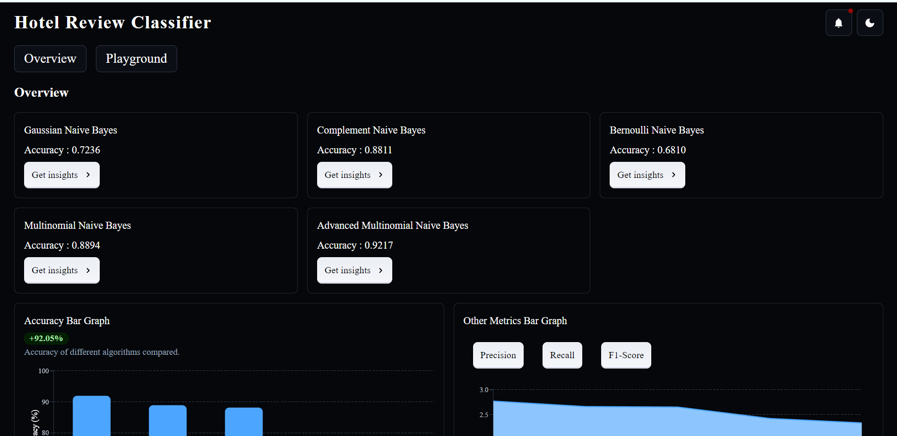
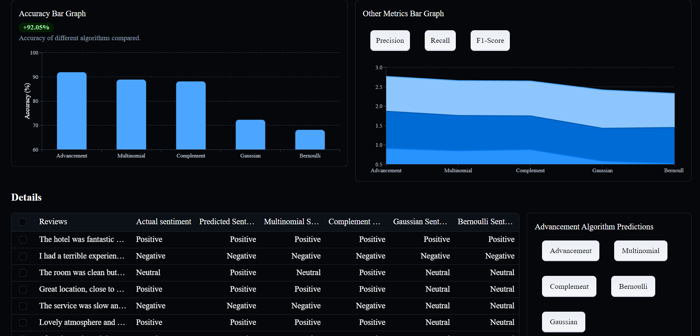
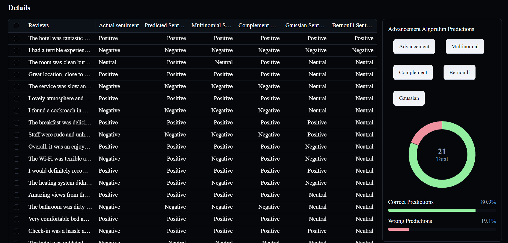
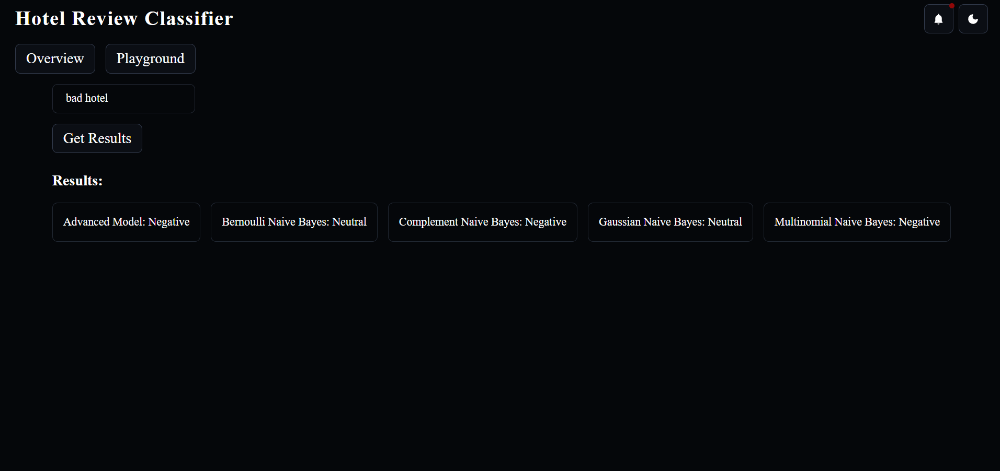

# Hotel Review Sentiment Analysis

This project analyzes hotel reviews using machine learning techniques to determine their sentiment (positive, negative, or neutral). It features a backend built with Flask and a frontend built with React.






## Table of Contents
- [Project Overview](#project-overview)
- [Features](#features)
- [Technologies Used](#technologies-used)
- [Installation](#installation)
- [Usage](#usage)
- [Contributing](#contributing)
- [License](#license)

## Project Overview
This project aims to analyze hotel reviews and determine the sentiment (positive, negative, neutral) expressed in them. Using various machine learning algorithms, the project evaluates the reviews and provides insights into customer satisfaction.

## Features
- Sentiment analysis of hotel reviews using multiple algorithms (e.g., Multinomial Naive Bayes, Complement Naive Bayes, Gaussian Naive Bayes, etc.)
- User-friendly interface for inputting reviews and displaying results
- Visualization of sentiment analysis results through charts
- Data preprocessing and feature extraction techniques applied for improved accuracy

## Technologies Used
- **Frontend**: React, Material-UI, Chart.js
- **Backend**: Flask, Python
- **Machine Learning**: scikit-learn, NLTK, pandas, NumPy
- **Database**: MongoDB (or your chosen database)
- **Version Control**: Git, GitHub

## Installation

### Set up the Backend:

1. Navigate to the backend directory:
    ```bash
    cd backend
    ```

2. Install the required packages:
    ```bash
    pip install -r requirements.txt
    ```

3. Start the backend server:
    ```bash
    python app.py
    ```

### Set up the Frontend:

1. Navigate to the frontend directory:
    ```bash
    cd frontend
    ```

2. Install the required packages:
    ```bash
    npm install
    ```

3. Start the frontend server:
    ```bash
    npm start
    ```

## Usage

1. Access the application through `http://localhost:3000` in your web browser.
2. Input a hotel review into the provided text area.
3. Click the "Analyze" button to see the sentiment results.
4. Review the visualized results for a clearer understanding of the sentiment distribution.

## Contributing

Contributions are welcome! To contribute to this project, please follow these steps:

1. Fork the repository.
2. Create a new branch:
    ```bash
    git checkout -b feature/YourFeature
    ```

3. Make your changes and commit them:
    ```bash
    git commit -m 'Add new feature'
    ```

4. Push to the branch:
    ```bash
    git push origin feature/YourFeature
    ```

5. Open a pull request.

## License

This project is licensed under the MIT License. See the LICENSE file for details.
